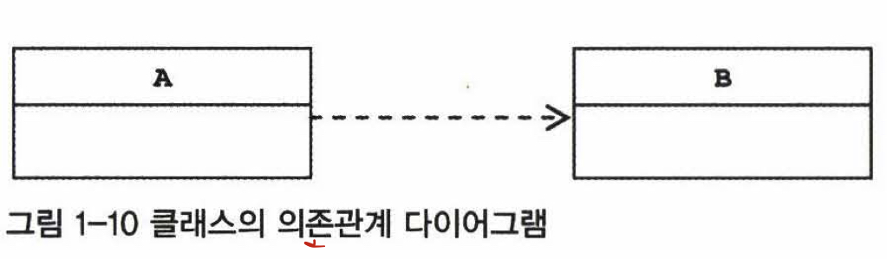

# 토비의 스프링 1장. 오브젝트 의존 관계

* 스프링의 IOC

<hr>

## 1. 스프링의 IOC

> 스프링은 여러 얼굴을 가졌다
 
* 스프링은 애플리케이션 개발의 다양한 영역과 기술에 관여합니다.
* 스프링의 핵심을 담당하는 것은 빈 팩토리 또는 애플리케이션 컨텍스트

#### 오브젝트 팩토리를 이용한 스프링 IoC

스프링에서는 스프링이 제어권을 가지고 직접 만들고 관계를 부여하는 오브젝트를<br>
-> <b>빈(Bean)</b>이라고 부릅니다.

자바빈 또는 엔터프라이즈 자바빈(EJB)에서 말하는 빈과 비슷한 <b>오브젝트 단위의 애플리케이션 컴포넌트</b>를 말합니다.

> [엔터프라이즈 자바빈이란?](https://ko.wikipedia.org/wiki/%EC%97%94%ED%84%B0%ED%94%84%EB%9D%BC%EC%9D%B4%EC%A6%88_%EC%9E%90%EB%B0%94%EB%B9%88%EC%A6%88)

스프링 빈은 스프링 컨테이너가 생성과 관계설절, 사용 등을 제어해주는 <b>제어의 역전(IoC)이 적용된 오브젝트</b>를 의미합니다.

스프링 빈 정리
* 스프링이 제어권을 가지고 직접 만들고 관계를 부여하는 오브젝트
* 제어의 역전이 적용된 오브젝트

스프링에서는 빈의 생성과 관계설정 같은 제어를 담당하는 IoC 오브젝트(이전에 만들었던 BeanFactory 클래스)
-> 빈 팩토리(Bean Factory)라고 부릅니다.

> 보통 빈 팩토리를 보다 확장한 애플리케이션 컨텍스트(Application Context)를 주로 사용합니다.
> 애플리케이션 컨텍스트는 IoC 방식을 따라 만들어진 일종의 빈 팩토리라고 생각하면 됩니다.

* 빈 팩토리 : 빈을 생성하고 관계를 설정하는 IoC의 기본 기능에 초점을 맞춘 것
* 애플리케이션 컨텍스트 : 애플리케이션 전바에 걸쳐 모든 구성요소의 제어 작업을 담당하는 IoC 엔진

@Configuration - 애플리케이션 컨텍스트 또는 빈 팩토리가 사용할 설정정보 라는 표시<br>
@Bean - 오브젝트 생성을 담당하는 IoC용 메서드라는 표시<br>
두 애너테이션은 자바코드의 탈을 쓰고있지만 사실은 XML과 같은 스프링 전용 설정정보 라고 보는것이 좋습니다.

애플리케이션 컨텍스트 -> ApplicationContext 타입의 오브젝트 

ApplicationContext 를 구현한 클래스는 여러 가지가 있습니다.
* AnnotationConfigApplicationContext : @Configuration 이 붙은 코드를 설정정보로 사용할 때 이용하면 됩니다.
* .... 추후 업데이트

빈을 가져올 때는 ApplicationContext 의 getBean() 메서드를 활용
getBean(설정파일 메서드명, 리턴 타임 클래스)
ex) getBean("userDaoJdbc", UserDao.class)

> getBean 은 기본적으로 Object 타입을 리턴하게 되어있어서 매번 리턴되는 오브젝트에 다시 캐스팅 해줘야하 하는 부담이 있습니다.
> (UserDao) context.getBean("userDaoJdbc");
> 때문에 두 번째 파라미터에 리턴 타입을 주면, 제네릭 메서드 방식을 사용해서 캐스팅 코드는 사용하지 않아도 됩니다. 


<hr>

### 애플리케이션 컨텍스트의 동작방식

<b>애플리케이션 컨텍스트를 개발자들이 부르는 명칭</b>
* IoC 컨테이너
* 스프링 컨테이너
* 빈 팩토리
* 스프링 (애플리케이션 컨텍스트가 스프링의 가장 대표적인 오브젝트 이므로)

애플리케이션 컨텍스트는 ApplicationContext 인터페이스를 구현하는데, <br>
ApplicationContext는 빈 팩토리가 구현하는 BeanFactory 인터페이스를 상속 했으므로 일종의 빈 팩토리인 셈입니다.

앞에서 만들었던 DaoFactory 와 애플리케이션 컨텍스트를 사용하는것에 어떤 차이가 있는가?<br>
> 애플리케이션 컨텍스트를 사용하는 것은 범용적이고 유연한 방법으로 IoC 기능을 확장하기 위해서입니다.

<hr>

### 애플리케이션 컨텍스트를 사용할 때 얻을 수 있는 장점
* ### 클라이언트는 구체적인 팩토리 클래스를 알 필요가 없습니다.
    - 그 RoomDao 만들어주는 팩토리 클래스 이름이 뭐였지?? -> 팩토리 클래스를 하나씩 열어보며 찾아본다
    - 오브젝트가 필요할때마다 팩토리 오브젝트를 생성해야 하는 번거로움
    - 즉, 애플리케이션 컨텍스트를 이용하면 일관된 방식으로 원하는 오브젝트를 가져올 수 있습니다.
    
* ### 애플리케이션 컨텍스트는 종합 IoC 서비스를 제공해줍니다.
    - 애플리케이션 컨텍스트의 역할은 단지 오브젝트 생성과 다른 오브젝트와의 관계 설정만을 위한것이 아닙니다.
    - 오브젝트가 만들어지는 방식, 시점과 전략을 다르게 설정할 수 있고, 자동생성, 오브젝트의 후처리, 정보의 조합, 설정 방식의 다변화, 인터셉팅 등
    - 오브젝트를 효과적으로 활용할 수 있는 다양한 기능을 제공
    
* ### 애플리케이션 컨텍스트는 빈을 검색하는 다양한 방법을 제공합니다.
    - getBean() 메서드는 빈의 이름을 이용해 빈을 찾아줍니다.
    - 타입만으로 빈을 검색하거나 애너테이션이 설정되어 있는 빈을 찾을 수도 있습니다.

<hr>    

### 스프링 IoC의 용어 정리
* 빈 (Bean)
    - 스프링이 IoC 방식으로 관리하는 오브젝트라는 뜻
    - 관리되는 오브젝트(managed object)라고 부르기도 합니다.
    - 스프링이 직접 그 생성과 제어를 담당하는 오브젝트 만을 의미.
> 주의할 점 - 스프링을 사용하는 애플리케이션에서 만들어지는 모든 오브젝트가 빈은 아닙니다.

* 빈 팩토리 (Bean Factory)
    - 스프링의 IoC를 담당하는 핵심 컨테이너
    - 빈을 등록하고 생성하고 조회하고 돌려주고, 그 외에 부가적인 빈을 관리하는 기능을 담당
> 보통 빈 팩토리를 사용하지 않고 이를 확장한 애플리케이션 컨텍스트를 이용합니다.
  
* 애플리케이션 컨텍스트 (Application Context)
    - 빈 팩토리를 확장한 IoC 컨테이너
    - 빈을 등록하고 관리하는 기본적인 기능은 빈 팩토리와 동일
    - 스프링이 제공하는 각종 부가 서비스를 추가로 제공
    - 애플리케이션 컨텍스트라고 할 때는 스프링이 제공하는 애플리케이션 지원 기능을 모두 포함해서 이야기하는 것
> 빈 팩토리라고 부르는 경우는 주로 빈의 생성과 제어의 관점에서 이야기 하는 것

* 설정정보 / 설정 메타정보 (Configuration Metadata)
    - 애플리케이션 컨텍스트 또는 빈 팩토리가 IoC를 적용하기 위해 사용하는 메타정보를 의미
    - 스프링의 설정정보는 컨테이너에 어떤 정보를 세팅하거나 조정하는 경우에도 사용하지만, 
    - 그보다는 IoC 컨테이너에 의해 관리되는 애플리케이션 오브젝트를 생성하고 구성할 때 사용.
> 애플리케이션의 형상정보 라고도 합니다.

* 컨테이너 (Container) 또는 IoC 컨테이너
    - IoC 방식으로 빈을 관리한다는 의미에서 애플리케이션 컨텍스트나 빈 팩토리를 의미
    - 컨테이너(스프링 컨테이너) == 애플리케이션 컨테이너
    - IoC 컨테이너 == 빈 팩토리 관점에서 이야기 하는 것
    
* 스프링 프레임워크
    - IoC 컨테이너, 애플리케이션 컨텍스트를 포함해서 스프링이 제공하는 모든 기능을 통틀어 말함
  
<hr>

## 2. 싱글톤 레지스트리와 오브젝트 스코프

* DaoFactory 를 직접 사용하는것 (new DaoFactory().userDaoJdbc()처럼 사용하는 것)
* @Configuration 애너테이션을 추가해서 스프링의 애플리케이션 컨텍스트를 통해 사용하는 것
위의 두가지는 어떤 차이가 있을까요?

만약 DaoFactory(@Configuration을 붙이지 않은)을 사용해서 userDaoJdbc() 메서드를 두번 호출해서 만든 UserDao 오브젝트는 동일한(identical) 오브젝트 일까?

> ### 오브젝트의 동일성과 동등성<br>
> 자바에서 두 개의 오브젝트가 <br>
> 완전히 같은 동일한(identical) 오브젝트 라고 하는것과 -> 동일성 비교, == 연산자 사용<br>
> 동일한 정보를 담고 있는(equivalent) 오브젝트라고 말하는 것 -> 동등성 비교, equals() 메서드 사용<br>
> equals() 메서드를 따로 오버라이딩해서 구현하지 않으면 Object 의 equals() 메서드를 그대로 사용하는데 이는 두 오브젝트의 동일성을 비교해서 결과를 반환합니다.

결론적으로 위의 DaoFactory 의 userDaoJdbc() 메서드는 매번 다른 오브젝트를 생성해줍니다.<br>
하지만 스프링 애플리케이션 컨텍스를 사용해서 생성하는 UserDao 오브젝트는 매번 같은 오브젝트를 반환해줍니다.

<hr>

### 싱글톤 레지스트리로서의 애플리케이션 컨텍스트
애플리케이션 컨텍스트는 <b>싱글톤</b>을 저장하고 관리하는 <b>싱글톤 레스트트리</b> 이기도 합니다.

스프링은 기본적으로 별다른 설정을 하지 않으면 내부에서 생성하는 <b>빈 오브젝트는 모두 싱글톤으로 만듭니다.</b>

태생적으로 스프링은 엔터프라이즈 시스템을 위해 고안된 기술이기 때문에 서버환경에서 사용될 때 그 가치가 있습니다.
> 실제로 스프링은 대부분 서버환경에서 사용됩니다.

만약 초당 수십, 수백번의 요청이 오는데 그 때마다 각 로직을 담당하는 오브젝트가 새로 만들어지고 사용된다면 서버에 부하가 발생합니다.<br>
이런 부하를 줄이기 위해 엔터프라이즈 분야에서는 서비스 오브젝트라는 개념을 일찍부터 사용해왔습니다.<br>
서블릿은 대부분 멀티스레드 환경에서 싱글톤으로 동작합니다.<br>
* 서블릿 클래스당 하나의 오브젝트만 만들어두고, 
* 사용자의 요청을 담당하는 여러 스레드에서 하나의 오브젝트를 공유해 동시에 사용합니다.

> ### [싱글턴 패턴이란?](https://julog.netlify.app/JavaScript/Singleton_Pattern/) 
> 애플리케이션 안에 제한된 수, 대개 한 개의 오브젝트만 만들어서 사용하는 것이 싱글톤 패턴의 원리

<hr>

### 싱글톤 패턴의 한계

```
public class SingletonUserDao {
    private static SingletonUserDao INSTANCE;

    private final ConnectionMaker connectionMaker;

    private SingletonUserDao(ConnectionMaker connectionMaker) {
        this.connectionMaker = connectionMaker;
    }

    public static synchronized SingletonUserDao getInstance() {
        if (INSTANCE == null) INSTANCE = new SingletonUserDao(new SimpleConnectionMaker());
        return INSTANCE;
    }
}
```

<br>

* #### 깔끔하게 구현했던 UserDao 보다 코드가 지저분해졌습니다.
* #### private 로 바뀐 생성자는 외부에서 호출 할 수가 없기 때문에 DaoFactory 에서 UserDao 를 생성하며 ConnectionMaker 오브젝트를 넣어주는 게 이제는 불가능해졌습니다.
* #### private 생성자를 갖고 있기 때문에 상속할 수 없습니다.
    - 객체 지향의 장점인 상속과 이를 이용한 다형성을 적용할 수 없습니다.
    - 객체 지향의 특징이 적용되지 않는 스태틱 필드와 메서드를 사용하는 것도 역시 동일한 문제
* #### 싱글톤은 테스트하기가 힘듭니다.
  - 만들어지는 방식이 제한적
  - Mock 오브젝트 등으로 대체하기가 힘들다.
* ####  서버환경에서는 싱글톤이 하나만 만들어지는 것을 보장하지 못합니다.
  - 서버의 클래스 로더가 어떻게 구성되느냐에 따라서 싱글톤 클래스임에도 하나 이상의 오브젝트가 만들어질 수 있다.
* #### 싱글톤의 사용은 전역 상태를 만들 수 있기 떄문에 바람직하지 못합니다.
  - 싱글톤은 스태틱 메서드를 이용해 언제든지 싱글톤에 쉽게 접근할 수 있기 때문에 애플리케이션 어디서든지 사용될 수 있다.
  - 즉, 전역 상태로 사용되기 쉽다.
  - 전역 상태를 갖는 것은 객체지향 프로그래밍에서는 권장되지 않는 프로그래밍 모델
  
<hr>

### 싱글톤 레지스트리

자바의 기본적인 싱글톤 패턴의 구현방식은 여러 가지 단점이 있기 때문에 <br>
스프링은 직접 싱글톤 형태의 오브젝트를 만들고 관리하는 기능을 제공합니다.<br>

> ### 이것이 싱글톤 레지스트리(Singleton Registry)입니다.

싱글톤 레지스트리의 장점
* private 생성자와 스태틱 메서드를 사용하지 않고 평범한 자바 클래스를 싱글톤으로 활용하게 해줍니다.
* public 생성자를 가질 수 있기 때문에 테스트 환경에서 자유롭게 오브젝트를 만들 수 있고 Mock 오브젝트로 대체하는 것도 간단합니다.
* 싱글톤 패턴과 달리 스프링이 지지하는 객체지향적인 설계 방식과 원칙, 디자인 패턴등을 적용하는 데 아무런 제약이 없습니다.

<hr>

### 싱글톤과 오브젝트의 상태 (feat. 싱글톤으로 만들어지기 떄문에 주의할 점)

* 멀티스레드 환경이라면 여러 스레드가 동시에 접근할 수 있음
* 상태 정보를 내부에 갖고 있지 않은 무상태(stateless)방식으로 만들어져야 한다.
* 자신이 사용하는 다른 싱글톤 빈을 저장하기 위한 인스턴스 필드를 허용됩니다.

<hr>

### 스프링 빈의 스코프

스프링이 관리하는 오브젝트, 즉 빈이 생성되고, 존재하고, 적용되는 범위<br>
이것들을 스프링에서 <b>빈의 스코프</b>라고 합니다.

* 빈의 기본 스코프는 <b>싱글톤</b>
  - 기본적으로 한 개의 오브젝트만 만들어집니다.
  - 강제로 제거하지 않는 한 스프링 컨테이너가 존재하는 동안 계속 유지
* 빈을 요청할 때 마다 새로운 오브젝트를 만들어주는 <b>프로토타입</b>
* 웹을 통해 새로운 HTTP 요청이 생길때마다 생성되는 요청(Request) 스코프
* 웹의 세션과 스코프가 유사한 세션(Session)스코프

<hr>

## 3. 의존관계 주입(DI)

### 제어의 역전(IoC)과 의존관계 주입(DI)

기존의 IoC 라는 용어는 범위가 너무 넓어서 스프링을 IoC라고 한다면 스프링이 제공하는 기능의 특징을 명확하게 설명하지 못했습니다.<br> 
> 의존관계 주입(Dependency Injection) : 스프링이 제공하는 IoC 방식의 핵심을 짚어주는 이름

<hr>

### 런타임 의존관계 설정
* #### 의존 관계
두 개의 클래스 또는 모듈이 의존관계에 있다고 말할 때는 항상 방향성을 부여해줘야 합니다.

> 즉 누가 누구에게 의존하는 관계에 있다는 식이어야 합니다.

아래의 그림은 A가 B에게 의존하고 있음을 나타냅니다.


의존하고 있다는 건 B 가 변하면 A에도 영향을 미친다는 뜻입니다.<br>
B에 기능이 추가되거나 변경되거나 형식이 바뀌거나 하면 그 영향이 A로 전달된다는 것입니다.<br>
<br>
반대로 말하면 B는 A의 변화에 영향을 받지 않는다는 뜻입니다.

인터페이스에 대해서만 의존관계를 만들어두면 생기는 장점 
* 인터페이스 구현 클래스와의 관계는 느슨해지므로 
* 변화에 영향을 덜 받을 수 있습니다.

### 런타임시에 만들어지는 의존관계
런타임 의존관계 또는 오브젝트 의존관계라고 합니다.<br>
설계 시점에 의존 관계가 실체화 된 것

> 런타임 의존관계는 모델링 시점의 의존관계 와는 성격이 분명히 다릅니다.

인터페이스를 통해 설계 시점에 느슨한 의존관계를 갖는 경우에는 UserDao의 객체가 런타임시에 사용할 객체가 어떤 클래스로 만든 것인지 미리 알 수가 없습니다.<br>
개발자가 어떤 UserDao 또는 ConnectionMaker 를 사용할 지 정할 수 있지만<br>
<b>코드 속에는 드러나지 않는다는 말입니다.</b>

> 런타임 시에 의존관계를 맺는 대상, 즉 실제 사용대상인 오브젝트를 의존 오브젝트(dependent object) 라고 말합니다.

의존관계 주입(DI)은 구체적인 의존 오브젝트와 그것을 사용할 주체, 보통 클라이언트라고 부르는 오브젝트를 런타임시에 연결해주는 작업을 의미합니다.<br>
<br>
클라이언트 오브젝트 ----의존관계 주입----> 구체적인 의존 오브젝트

### 의존관계 주입을 충족하기 위한 세 가지 조건
* 클래스 모델이나 코드에는 런타임 시점의 의존관계가 드러나지 않는다. (인터페이스에만 의존하고 있어야함)
* 런타임 시점의 의존관계는 컨테이너나 팩토리 같은 제3의 존재가 결정합니다.
* 의존관계는 사용할 오브젝트에 대한 레퍼런스를 외부에서 제공(주입)해줌으로써 만들어집니다.

> ### 의존관계 주입의 핵심<br>
> 설계 시점에는 알지 못했던 두 오브젝트의 관계를 맺도록 도와주는 제 3의 존재가 있다는 것<br>
> <br>
> 여기서 말하는 제 3의 존재란?<br>
> 스프링의 애플리케이션 컨텍스트, 빈 팩토리, IoC 컨테이너 등이 모두 외부에서 오브젝트 사이의 런타임 관계를 맺어주는 책임을 지닌 제 3의 존재

<hr>

### 의존관계 검색과 주입

의존관계 검색 : 의존관계를 맺는 방법이 외부로부터 주입이 아니라 <b>스스로 검색을 이용하는 방법</b><br>

스프링의 애플리케이션 컨텍스트라면 미리 정해놓은 이름을 전달해서 그 이름에 해당하는 오브젝트(빈)을 찾게 됩니다.<br>
예시) getBean() 메서드

```
public {
    AnnotationConfigApplicationContext context = 
      new AnnotationConfigApplicationContext(DaoFactory.class);
    this.connectionMaker = context.getBean("connectionMaker", ConnectionMaker.class);
}  
```

위의 코드는 애플리케이션 컴포넌트가 컨테이너와 같이 성격이 다른 오브젝트(예시에서는 AnnotationConfigApplicationContext)에 의존하게 되는 것이므로 바람직하지 않습니다.<br>
따라서 대부분의 상황에서는 의존관계 주입 방식을 사용하는 편이 낫습니다.

> ### 그럼 언제 의존관계 검색을 사용하는가?<br>
> 스프링의 IoC와 DI를 적용했다 하더라도 애플리케이션의 기동 시점에서 적어도 한번은 의존관계 주입 방식을 사용해서 오브젝트(빈)을 가져와야 합니다.<br>
> 스태틱 메서드인 main()에서는 DI를 이용해 주입받을 방법이 없기 때문

<hr>

### 메서드를 이용한 의존관계 주입
생성자가 아닌 일반 메서드를 이용해 의존 오브젝트와의 관계를 주입해주는 데는 크게 두 가지 방법이 있습니다.
* 수정자 메서드를 이용한 주입
  + 일반적으로 사용하는 setter 방식
* 일반 메서드를 이용한 주입
  + 생성자는 필요한 모든 파라미터를 다 받아야 하지만 일반 메서드를 활용하면 그렇게 하지 않아도 됩니다.
  
<hr>

## 3. XML을 이용한 설정

스프링은 DaoFactory 와 같은 자바클래스를 이용하는 것 외에도, 다양한 방법을 통해 DI 의존관계 설정정보를 만들 수 있습니다.

> 가장 대표적인 것이 바로 XML

DI 정보가 담긴 XML 파일은 ```<beans>```를 루트 엘리먼트로 사용합니다.<br>

@Configuration == ```<beans>``` , @bean = ```<bean>``` 으로 매칭하면 쉽게 이해할 수 있을것입니다.

@Bean 메서드를 통해 얻을 수 있는 빈의 DI 정보는 세가지가 있습니다.
* 빈의 이름 : @Bean 메서드 이름이 빈의 이름, 이후 getBean() 에서 사용됨
* 빈의 클래스 : 빈 오브젝트를 어떤 클래스를 이용해서 만들지 정의
* 빈의 의존 오브젝트 : 빈의 생성자나 수정자 메서드를 통해 의존 오브젝트를 넣어줍니다.

XML 설정 파일 사용하기
기본적으로 설정파일의 path 는 resources 폴더 내부에 위치해야 합니다
GenericXmlApplicationContext 를 생성할 때 인자로 설정파일의 이름을 줍니다.
```
new GenericXmlApplication("applicationContext.xml");
```

<hr>

# 1장의 과정 돌아보기
* ### 관심사의 분리, 리팩토링
* ### 전략 패턴
* ### 개방 폐쇄 원칙
* ### 낮은 결합도, 높은 응집도
* ### 제어의 역전(IoC)
* ### 싱글톤 레지스트리
* ### 의존관계 주입(DI) / 의존관계 검색(DL)
* ### 생성자 주입과 수정자 주입
* ### XML 설정

1장에서 꼭 배우고(이해하고) 넘어갈 것
> #### 스프링이란 어떻게 오브젝트가 설계되고, 만들어지고, 어떻게 관계를 맺고 사용되는지에 관심을 갖는 프레임워크<br>
> 스프링의 관심은 오브젝트와 그 관계<br>
> 하지만 오브젝트를 어떻게 설계하고, 분리하고, 개선하고, 어떤 의존관계를 가질지 결정하는 일은 스프링이 아니라 개발자의 역할!! (IoC가 객체지향이라는 증거)<br>
> 스프링은 원칙을 잘 따르는 설계를 하려고 할 때 필연적으로 등장하는 번거로운 작업을 편하게 할 수 있도록 도와주는 도구<br>
> ### 스프링을 사용한다고 좋은 객체지향 설계와 깔끔하고 유연한 코드가 자동으로 만들어지는 것이 아님!!!

## 스프링은 좋은 설계와 코드를 적용하고자 할 때 좋은 동반자가 되어줄것입니다.


