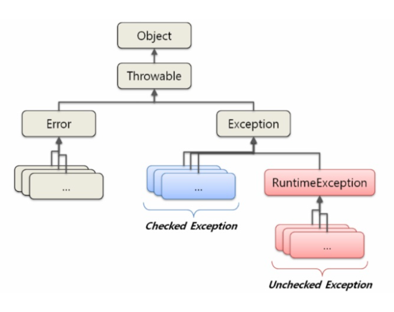

# 토비의 스프링 4장. 예외

---

예외처리는 자바 개발자가 귀찮아하는 것 중의 하나입니다.   
정상적인 결과와 흐름을 보여주는 코드를 만드는 것만 해도 힘든데 예외 상황까지 처리하려면 부담스럽기 때문입니다.   
하지만 예외 처리를 소홀히 하거나 무성의하게 만들어진 예외 처리 코드는 이후에 찾기 힘든 버그를 낳을 수도 있고 상상하지 않았던 예외 상황이 발생했을 때 난처해질 수 있습니다.

4장에서는 JdbcTemplate를 대표로 하는 스프링의 데이터 액세스 기능에 담겨 있는 예외처리와 관련된 접근 방법에 대해 알아봅니다.

---

## 사라진 SQLException

JdbcTemplate를 사용했던 코드를 살펴보면 ```throws SQLException```이 사라진걸 알 수 있습니다.   
JDBC API 메서드들이 던지는 SQLException이 사라진것 입니다.

JDBC를 막 배우고 사용하는 코드는 다음과 같습니다.

```java
try{
    ...
} catch(SQLException e) {
}
```

위 코드에서 문제점은 예외를 잡고 아무 행동도 하지않고 끝내버리는 행위입니다.   
별 문제없이 잘 동작하겠지만 이는 원치 않는 예외가 발생하는 것보다 훨씬 더 나쁜일입니다.
그 이유는 프로그램을 돌다가 해당 코드에서 SQLException이 발생했지만 그것을 무시하고 계속 진행됩니다.

아래의 코드도 마찬가지 입니다.

```java
} catch(SQLException e) {
    System.out.println(e);
}
```

```java
} catch(SQLException e) {
    e.printStackTrace();
}
```

위 코드는 로그나 메세지는 찍어주지만 거기서 끝입니다.   
결국 다른 로그나 메세지에 묻혀버리게 되고 프로그램이 의도한대로 동작하지 않을 때   
-> 우리는 수많은 로그 속에서 catch 에서 찍어준 로그나 메세지를 찾아내야합니다.   

> 콘솔 로그를 누군가 모니터링 하지 않는 이상 이 예외 코드는 심각한 폭탄으로 남아 있을 것입니다.

# 예외 처리를 할 때 지켜야 할 핵심 원칙

## 모든 예외는 적절하게 복구 되던지 아니면 작업을 중단시키고 운영자 또는 개발자에게 분명하게 통보돼야 합니다.

> SQLException이 발생하는 이유는    
> * SQL 문법에 에러가 있거나    
> * DB에서 처리할 수 없을 정도로 데이터 로직에 심각한 버그가 있거나   
> * 서버가 죽거나   
> * 네트워크가 끊기는 등   
> 
> 심각한 상황이 일어났을 때 입니다.
> 이런 예외 상황을 무시하고 정상적으로 동작하는 것처럼 다음 코드로 실행을 이어간다는 건 말이 되지 않습니다.

예외를 잡고 아무 행동도 하지않고 넘겨버리는것 보다는 발생한 예외를 throws를 이용해 밖으로 던져버려 책임을 전가하는게 낫습니다.
(좋은 행위는 아니라고 생각합니다. 다만 예외를 catch 후에 아무것도 하지 않는것 보다는 낫습니다.)

### 무의미하고 무책임한 throws

catch 블록으로 예외를 잡아도 해결할 방법이 없을 때 각종 예외를 처리하는것도 귀찮은 나머지 모든 예외를 throws Exception 으로 밖에 던져버리는 개발자도 있습니다.

이는 예외를 잡고 아무 행동도 하지 않고 넘기는것 보다는 낫지만 위에서 말한 무책임한 throws도 심각한 문제점이 있습니다.

내가 사용하려는 메서드에 throws Exception 이 선언되어 있다면 그 메서드에서는 예외에 대한 의미있는 정보를 얻을 수 없습니다.

---

## 정리 : 예외 처리에 대한 나쁜 습관 두 가지
첫 번째. 예외를 catch하여 아무것도 하지않고 넘겨버리는 예외 블랙홀을 만드는 것
두 번째. 무의미하고 무책임한 throws를 사용하는 것

---

## 예외의 종류와 특징

자바에서 throw를 통해 발생시킬 수 있는 예외는 크게 아래 세 가지가 있습니다.
* Error(에러)
* Checked Exception (체크 예외)
* UncheckedException(언체크 예외, 런타임 예외)

### Error

java.lang.Error 클래스의 서브클래스들을 의미합니다..

에러는 시스템에 뭔가 비정상적인 상황이 발생했을 경우에 사용됩니다.   
ex) OutOfMemoryError, ThreadDeath 같은 에러   
주로 자바 VM에서 발생시키는 것이고 애플리케이션 코드에서 잡으려고 하면 안됩니다. catch블록으로 잡아봤자 아무런 대응 방법이 없기 때문입니다.

### Exception과 체크 예외

java.lang.Exception 클래스와 서브클래스를 의미합니다.

개발자들이 만든 애플리케이션 코드의 작업 중에 예외상황이 발생했을 경우에 사용됩니다.

Exception 클래스는 다시 체크 예외와 언체크 예외로 구분됩니다.

* 체크 예외는 Exception 클래스의 서브클래스 이면서 RuntimeException 클래스를 상속하지 않은 것들
* 언체크 예외는 RuntimeException을 상속한 클래스들을 말합니다.



**체크 예외가 발생할 수 있는 메서드를 사용할 경우 반드시 예외를 처리하는 코드를 함께 작성해야 합니다.**

> 체크 예외에 대한 예외 처리를 하지않으면 컴파일 에러가 발생합니다.
> 자바 언어와 JDK의 초기 설계자들은 체크 예외를 발생 가능한 예외에 모두 적용하려고 했던것 같습니다.

### RuntimeException과 언체크/런타임 예외

java.lang.RuntimeException 클래스를 상속한(서브클래스) 예외들을 의미합니다.   

명시적인 예외처리를 상제하지 않기 떄문에 **언체크 예외**라고 불립니다.
(런타임 예외라고도 부릅니다.)

> 언체크 예외는 catch문으로 잡거나 throws로 예외 처리르 하지 않아도 됩니다.

런타임 예외는 주로 프로그램의 오류가 있을 때 발생하도록 의도된 것들 입니다.
ex) null 값인 객체를 사용하려할 때 발생하는 NullPointerException, 허용되지 않는 값을 사용해서 메서드를 호출할 때 발생하는 IllegalArgumentException 등이 있습니다.

런타임 예외는 코드에서 미리 조건을 체크하도록 해서 주의깊게 만든다면 피할 수 있는 예외이지만   
개발자가 부주의해서 발생할 수 있는 경우에 발생하도록 만든 것이 런타임 예외입니다.   
따라서 언체크 예외는 예상하지 못한 예외상황이 아니기 때문에 굳이 catch나 throws를 사용하지 않아도 되도록 만든것입니다.

---

## 예외처리 방법

* 예외 복구
* 예외처리 회피
* 예외 전환

### 예외 복구

예외 상황을 파악하고 문제를 해결해서 **정상 상태로 돌려놓는 것입니다.**   
예외로 인해 기본 작업 흐름이 불가능하면 다른 작업 흐름으로 자연스럽게 유도해주는 것입니다.

예를 들어 
* 사용자가 요청한 파일이 없어서 IOException이 발생했을 때 사용자에게 상황을 알려주고 다른 파일을 이용하도록 안내하는 것

> 단, IOException이 단순하게 에러 메세지만 사용자에게 던져지는 것은 예외 복구라 할 수 없습니다.   
> 예외 복구란 예외가 처리됐으면 비록 기능적으로는 사용자에게 예외상황으로 보여도 애플리케이션에서는 정상적으로 설계된 흐름을 따라 진행돼야 하는 것입니다.

예외처리 코드를 강제하는 **체크 예외들은** 이렇게 예외를 어떤 식으로든 복구할 가능성이 있는 경우에 사용합니다.

개발자로 하여금 예외상황이 발생할 수 있음을 인식하도록 도와주고 이에 대한 적절한 처리를 시도해보도록 요구하는 것입니다.

```java
int maxretry = MAX_RETRY;
while(maxretry-- > 0) {
    try {
        ...         // 예외가 발생할 가능성이 있는 시도
        return;     // 작업 성공하여 반환
    } catch (SomeException e) {
        // 로그 출력. 정해진 시간만큼 대기    
    } finally {
        // 리소스 반납. 정리 작업    
    }
}
throw new RetryFailedException(); // 최대 재시도 횟수를 넘기면 직접 예외 발생
```

### 예외처리 회피

예외처리를 자신이 담당하지 않고 자신을 호출한 쪽으로 던져버리는것 입니다.   
예외를 자신이 처리하지 않고 회피하는 방법입니다.

* throws 문을 선언해서 예외가 발생하면 자동으로 던져버린다.
* catch 문으로 일단 예외를 잡은 후에 로그를 남기고 다시 예외를 던지는것(되던지기)

예외를 잡고 아무것도 하지않거나 무책임하게 Exception을 밖으로 되던지는 것은 예외처리 회피가 아니라 예외를 잘못처리한 경우라는 것을 잊지 말아야합니다.

예외처리 회피란 다른 오브젝트가 예외를 대신 처리할 수 있도록 바깥으로 던져주는 것을 의미합니다.

```java
public void add() throws SQLException{
    // JDBC API
}
```

```java
public void add() throws SQLException{
    try {
        // JDBC API
    } catch (SQLException e) {
        // 로그 출력
        throw e;
    }
}
```

> 예외회피는 언제 해야하는가?
> 발생한 예외를 처리하는 일이 해당 오브젝트의 역할이 아니라고 생각할 떄 외부로 던져줍니다.   
> 만약 해당 오브젝트를 사용하는 대상과 해당 오브젝트가 긴밀한 관계를 가지고 있지 않은데도 밖으로 예외를 던져주는 행위는 주의해야합니다. 이는 무책임한 책임회피일 수 있습니다.   
> 따라서 예외를 회피하는 것은 예외 복구처럼 그 의도가 분명해야합니다.   
> 
> 긴밀한 관계에 있는 다른 오브젝트에게 예외처리 책임을 분명하게 넘기거나   
> 자신을 사용하는 쪽에서 예외를 다루는게 최선의 방법이라는 확신이 있을 때 사용해야합니다.

### 예외 전환

예외 회피처럼 예외를 밖으로 던지지만 발생한 예외를 그대로 넘기는 것이 아닌 **적절한 예외로 전환해서 던진다는 특징**이 있습니다.

```java
public void add(User user) throws DuplicateUserIdException, SQLException {
    try {
        // JDBC를 이용해 user정보를 DB에 추가하는 코드 또는
        // 그런 기능을 가진 다른 SQLException을 던지는 메서드를 호출하는 코드
    } catch(SQLException e) {
        //ErrorCode가 MySQL의 "Duplicate Entry(1062)"이면 예외 전환
        if (e.getErrorCode() == MysqlErrorNumbers.ER_DUP_ENTRY) {
            throw new DuplicateUserException();
        } else {
            throw e; // 그 외에 경우는 SQLException 그대로
        }
    }
}
```

보통 전환하는 예외에 원래 발생한 예외를 담아서 중첩 예외(nested exception)로 만드는 것이 좋습니다.

> 중첩 예외는 getCause() 메서드를 활용해서 처음 발생한 예외가 무엇인지 확인할 수 있습니다.

예외 전환의 목적
* 발생한 예외를 그대로 던지는 것이 예외 상황에 대한 적절한 의미를 부여해주지 못해서, 의미가 분명한 예외로 바꿔주기 위해
    + API에서 발생하는 기술적인 로우레벨 상황에 적합한 의미를 가진 예외로 변경하는것입니다.
* 예외를 처리하기 쉽고 단순하게 만들기 위해 포장(wrap)하는 것입니다.
    + 주로 예외처리를 강제하는 체크 예외를 언체크 예외인 런타임 예외로 바꾸는 경우에 사용합니다.
    
> 일반적으로 체크예외를 계속 throws 해서 넘기는 건 무의미합니다. 메서드 선언은 지저분해지고 아무런 장점이 없습니다.
> 예를 들어 웹 컨트롤러 메서드에 붙어있는 throws SQLException 코드를 상상해보면 어떻게 할 방법이 떠오르지 않습니다. 이것은 잘못된 방법입니다.

---

## 예외처리 전략

### 런타임 예외의 보편화

체크 예외는 복구할 가능성이 조금이라도 있는, 말 그대로 예외적인 상황이기 떄문에 체크 예외에 대한 처리는 강제되고 있습니다.   
예외처리를 강제하는 것은 API 메서드를 사용하는 개발자의 실수를 방지하기 위한 배려라고 볼 수도 있겠지만   
#### 실제로는 예외를 다루고 싶지 않을 만큼 짜증나게 만드는 원인이 될 수 있습니다.

자바의 환경이 서버로 이동하면서 체크 예외의 활용도와 가치는 점점 떨어지고 있습니다.   
무책임한 throws Exception으로 범벅이 된 아무런 의미없는 메서드들이 만들어질 수 있습니다.
만약 대응이 불가능한 체크 예외라면 최대한 빨리 언체크 예외(런타임 예외)로 전환해서 던지는 게 낫습니다.

> 언체크 예외 또한 catch 하여 예외 복구를 시도할 수 있으니 요즘은 API 차원에서 런타임 예외를 던지도록 만드는 추세입니다.

런타임 예외를 일반화해서 사용하는 방법은 여러모로 장점이 많습니다.   
### 단 런탸임 예외로 만들었기 떄문에 사용에 더 주의를 기울일 필요가 있습니다.

컴파일러가 예외처리를 강제하지 않으므로 신경 쓰지 않으면 예외 상황을 충분히 고려하지 않을 수도 있기 때문입니다.

> 런타임 예외를 사용하는 경우에는 API 문서나 레퍼런스 문서 등을 통해, 메서드를 사용할 때 발생할 수 있는 예외의 종류와 원인, 활용방법을 자세히 설명해둬야 합니다.

### 애플리케이션 예외

시스템 또는 외부의 예외상황이 아니라 애플리케이션 자체의 로직에 의해 의도적으로 발생시키고, 반드시 catch 해서 무엇인가 조치를 취하도록 요구하는 예외를 의미합니다.

예를 들어, 통장에서 출금을 하는 애플리케이션이라면 통장의 잔고가 모자를 때 출금을 시도하면 작업을 중지 시키고 적절한 경고를 사용자에게 보내야 합니다.

이런 기능을 담은 메서드를 설계하는 방법은 두 가지 있습니다.

### 첫 번째 방법. 정상적인 결과와 예외상황이 발생했을 때 다른 종류의 리턴값을 돌려주는 것
위의 출금을 예로들면      
* 정상적인 출금 -> 요청금액 자체를 리턴
* 잔고가 부족 -> 0 또는 -1 처럼 특별한 값을 리턴   

단, 이 방법은 메서드를 호출한 쪽에서 반드시 리턴값을 확인해야 합니다. 경우에 따라 작업의 흐름이 달라져야 하기 때문입니다.
  
#### 단점
* 예외 상황에 대한 리턴값을 명확하게 코드화하고 잘 관리하지 않으면 혼란이 생깁니다.
* 예외 상황에 전달하는 값의 표준이란게 없기 때문에 직접 표준 코드를 만들어야합니다.
* 결과 값을 확인하는 조건문(if문)이 자주 등장한다는 점 입니다.
* 이로 인해 코드는 지저분해지고 흐름을 파악하고 이해하기 힘들어집니다.

### 두 번째 방법, 정상적인 흐름을 따르는 코드는 그대로 두고, 비즈니스적인 의미를 띤 예외를 던지도록 하는 것
이번에도 위의 출금을 예로들면
* 정상적인 출금 -> 정상적인 흐름을 유지
* 잔고가 부족 -> InsufficientBalanceException을 던진다.

이때 사용하는 예외는 의도적으로 체크 예외로 만듭니다. 개발자가 잊지 않고 잔고 부족처럼 자주 발생 가능한 예외상황에 대한 로직을 구현하도록 강제해주는것이 좋습니다.

```java
try {
    BigDecimal balance = account.withdraw(amount);
    ...
    // 정상적인 처리 결과를 출력하도록 진행
} catch (InsufficientBalanceException e) { // 체크 예외
    // InsufficientBalanceException에 담긴 인출 가능한 잔고금액 정보를 가져옴
    BigDecimal availFunds = e,getAvailFunds();
    ...
    // 잔고 부족 안내 메시지를 준비하고 이를 출력하도록 진행
}
```
---

## 그래서 JdbcTemplate에서 SQLException은 어떻게 됐나?

DAO에 존재하는 SQLException은 복구가 가능한 예외인가?
* 프로그램의 오류
* 개발자의 부주의
* 통제할 수 없는 외부 사항
    + SQL 문법이 틀림
    + 제약 조건을 위반
    + DB서바가 다운
    + DB 커넥션 풀이 꽉 차서 DB 커넥션을 가져올 수 없는 경우
-> 99% 코드 래밸에서는 복구할 방법이 없습니다.

즉, 시스템 예외라면 애플리케이션 레벨에서 복구할 방법이 없습니다.

> SQLException이 발생하면 입력 단계에서 검증을 강화해야 한다는 사실을 개발자가 빨리 알아챌 수 있도록 발생한 예외를 빨리 전달하는 것 외에는 할 수 있는게 없습니다.

DAO 밖에서도 SQLException을 다룰 수 있는 가능성은 거의 없기 때문에   
우리는 SQLException을 가능한 빨리 언체크/런타임 예외로 전환해줘야 합니다.

### 스프링의 JdbcTemplate은 바로 이 예외처리 전략을 따르고 있습니다.

JdbcTemplate 템플릿과 콜백 안에서 발생하는 모든 SQLException을 런타임 예외인 DataAccessException으로 전환해서 던져줍니다.

따라서 DAO 에서는 필요한 경우에만 DataAccessException을 catch해서 처리하고 나머지는 무시하면 됩니다.

JdbcTemplate의 update 메서드를 보면 아래와 같이 DataAccessException을 throws 하고 있습니다.

```java
public int update(final String sql) throws DataAccessException {...}
```

스프링의 JdbcTemplate이 던지는 DataAccessException은 일단 런타입 예외로 SQLException을 포장해주는 역할을 합니다.
* 대부분 복구가 불가능한 SQLException을 신경쓰지 않도록 해줍니다.
* DataAccessException에 SQLException에 담긴 다루기 힘든 상세한 예외 정보를 의미있고 일관성 있는 예외로 전환해서 추상화해주려는 용도로 쓰이기도 합니다.

---

## JDBC의 한계

JDBC가 DB에 접근하는 방법을 추상화된 API 형태로 정의해서 DB에 접근하는 방법이 쉬워진것은 사실입니다.   
하지만 JDBC에도 DB를 자유롭게 사용하는데는 두 가지 걸림돌이 존재합니다.

### 비표준 SQL
SQL은 어느 정도 표준화된 언어이고 몇 가지 표준 규약이 있긴 하지만,   
대부분의 DB는 표준을 따르지 않는 비표준 문법과 기능도 제공합니다.

> 이런 비표준 문법은 매우 폭넓게 사용되고 있습니다.   
> 해당 DB의 특별한 기능을 사용하거나 최적화된 SQL을 만들 때 유용하기 때문입니다.

이런 비표준 SQL은 결국 DAO 코드에 들어가고, 해당 DAO는 특정 DB에 종속적인 코드가 됩니다.   
-> 이런 상황에서 다른 DB를 사용하면 비표준 SQL에 의해 예외가 발생합니다.

이 문제의 해결책으로는
* 호환 가능한 표준 SQL만 사용하는 방법
* DB별로 별도의 DAO를 만든다.
* SQL을 외부에 독립시켜서 DB에 따라 변경해 사용하는 방법

> 표준 SQL만 사용하는 방법은 그다지 현실성이 없습니다.   
> 나머지 해결책은 이후에 알아본다고 합니다!

### 호환성 없는 SQLException의 DB 에러정보

DB를 사용하다가 발생할 수 있는 에러의 원인은 다양합니다.
* SQL 문법 오류
* 유니크 키가 중복
* 다양한 제약조건을 위배하는 시도
* DB 커넥션을 가져오지 못했을 경우
* 테이블이나 필드가 존재하지 않을 때
* 데드락에 걸렸거나 락을 얻지 못했을 때

문제는 DB마다 SQL만 다른것이 아니라 에러의 종류와 원인도 제각각이라는 점입니다.

그래서 JDBC는 데이터 처리 중에 발생하는 모든 예외를 SQLException 하나에 담아버립니다.

따라서 예외가 발생한 원인을 알기위해서는 SQLException 안에 담긴 에러 코드와 SQL 상태정보를 참조해봐야 합니다.

#### 하지만 SQLException의 getErrorCode()로 가져올 수 있는 DB 에러 코드는 DB별로 모두 다릅니다.

> 각 DB 벤더마다 정의한 고유 에러 코드가 다르기 떄문입니다.

SQLException은 예외가 발생했을 때의 DB 상태를 담은 SQL 상태정보를 부가적으로 제공합니다.   
getSQLState() 메서드로 예외상황에 대한 상태정보를 가져올 수 있습니다.

이 상태 정보는 DB 별로 달라지는 에러 코드를 대신할 수 있도록, Open Group의 XOPEN SQL 스펙에 정의된 SQL 상태 코드를 따르도록 되어 있습니다.

>이후에도 JDBC의 버전별로 SQL 99 의 관례, SQL2003의 관례를 따르도록 정의되어 있기는 합니다.

SQLException이 이런 상태 정보를 제공하는 이유는 DB에 독립적인 에러정보를 얻기 위해서입니다.   

#### 그런데 문제는 DB의 JDBC 드라이버에서 SQLException에 상태 코드를 제대로 (또는 정확하게) 만들어주지 않는다는 것 입니다.

따라서 SQL 상태 코드를 믿고 결과를 파악하도록 코드를 작성하는 것은 위험합니다.

---

## DB 에러 코드 매핑을 통한 전환

DB 종류가 바뀌더라도 DAO를 수정하지 않으려면 비표준 SQL 과 DB별 에러 코드가 다른 문제를 해결해야 합니다.

SQLException의 비표준 에러 코드와 SQL 상태정보에 대한 해결책으로는   
DB별 에러 코드를 참고해서 발생한 예외의 원인이 무엇인지 해석해 주는 기능을 만드는 것 입니다.

DB에서 직접 제공해주는 것이니 버전이 올라가도 어느 정도 일관성을 가짐

**해결 방법 : DB별 에러 코드를 참고해서 방생한 예외의 원인이 무엇인지 해석해 주는 기능을 만드는 것**

DB 종류에 상관없이 동일한 상황에서 일관된 예외를 전달받아 효과적인 대응이 가능하도록 하는 것입니다.

스프링은 DataAccessException이라는 SQLException을 대체할 수 있는 런타임 예외를 정의하고 있을 뿐 아니라 DataAccessException의 서브 클래스로 세분화된 예외 클래스들을 정의하고 있습니다.

> 데이터 액세스 작업 중에 발생할 수 있는 예외 상황을 수십 가지 예외로 분류하고 이를 추상화해 정의한 다양한 예외 클래스를 제공합니다.

스프링은 DB마다 제각각인 에러 코드를 분류해서 스프링이 정의한 예외 클래스와 매핑해놓은 에러 코드 매핑정보 테이블을 만들어두고 이를 이용합니다.   
즉, 단순히 DataAccessException만 발생하는게 아니라 에러 코드에 따라 DataAccessException의 서브클래스를 적절하게 사용합니다.

```java
public void add() throws DuplicateKeyException {
   // JdbcTempolate을 이용해 User를 add 하는 코드
}
```

만약 체크 예외로 전환하거나 의미를 더욱 부여한 언체크 예외를 던져주고 싶다면 다음과 같이 하면 됩니다.

```java
public void add() {
    try{
        // JdbcTempolate을 이용해 User를 add 하는 코드
    } catch(DuplicateKeyException e) {
        throw new DuplicateUserIdException(e);    
    }     
}
```

JDBC의 단일 예외 클래스인 SQLException도 더 세분화 되어 정의되었지만 SQLException의 서브클래스이므로 여전히 체크 예외라는 점과 그 세분화하는 기준이 SQL 상태 정보를 이용한다는 점에서 여전히 문제가 있습니다.

---

## DAO 인터페이스와 DataAccessException의 계층구조

DataAccessException은 단순히 JDBC의 SQLException을 전환하기 위한 용도로만 만들어진게 아닙니다.

자바의 다양한 데이터 액세스 기술들(JDO, JPA, iBatis 등등)에도 DataAccessException은 의미가 같은 예외라면 데이터 액세스의 기술의 종류와 상관없이 일관된 예외가 발생하도록 만들어줍니다.

> 데이터 액세스 기술에 독립적인 추상화된 예외를 제공하는 것입니다.

인터페이스 사용, 런타임 예외 전환과 함께 DataAccessException 예외 추상화를 적용하면 데이터 액세스 기술과 구현 방법에 독립적인 이상적인 DAO를 만들 수가 있습니다.

---

## 기술에 독립적인 DAO

데이터 액세스 기술에 독립적인 DAO 를 만들기 위해서 DAO 클래스를 인터페이스와 구현으로 분리할 수 있습니다.

```java
public interface UserDao {
    void add(User user);
    User get(String id);
    List<User> getAll();
    void deleteAll();
    int getCount();
}
```

---

## DAO 테스트에서는 DAO를 인터페이스로 받을 것인가? 구현 클래스로 받을 것인가?

테스트 코드를 작성하다가 인터페이스인 UserDao 를 받아서 테스트할 지

```java
public class UserDaoTest {
    @AutoWired
    private UserDao userDao;
}
```

구현체인 UserDaoJdbc 를 받아서 테스트할 지

```java
public class UserDaoTest {
    @AutoWired
    private UserDaoJdbc userDaoJdbc;
}
```

고민이 생긴적이 있을겁니다.

이 때도 어느 한쪽이 더 좋다 보다는 테스트의 관심을 어느쪽에 두느냐에 차이가 있다고 할 수 있습니다.

### 구현기술에 상관없이 DAO의 기능이 동작하는데만 관심이 있다면 인터페이스인 UserDao 를 사용합니다.

### 반면 특정 기술을 사용한 UserDao 를 테스트하고 싶다면 특정 타입의 구현체를 사용하면 됩니다.

