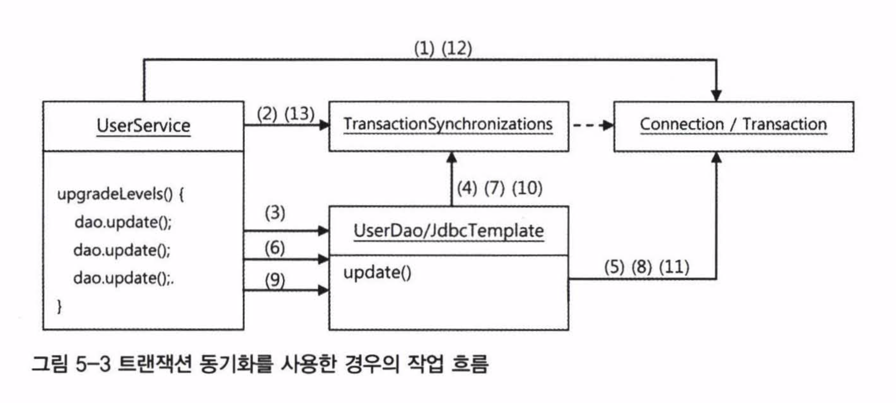
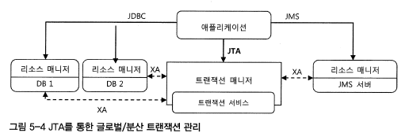
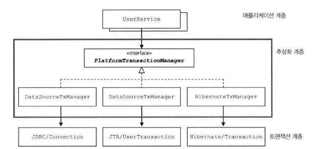
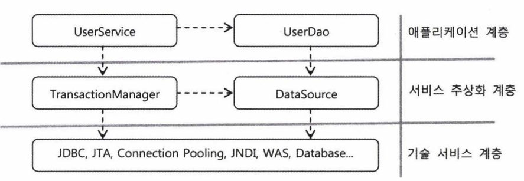
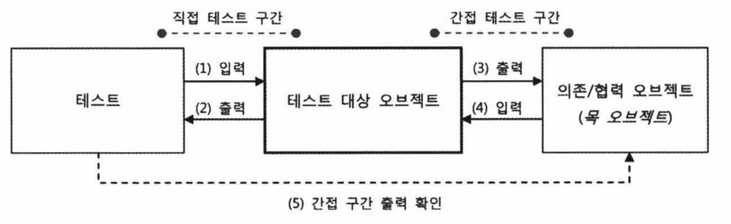

# 토비의 스프링 5장. 서비스 추상화

자바에는 사용 방법과 형식은 다르지만 기능과 목적이 유사한 기술이 존재합니다.(목적이 유사한 여러 기술이 공존하기도 합니다.)

5장에서는 DAO에 트랙잭션을 적용해보면서 스프링이 어떻게 성격이 비슷한 여러 종류의 기술을 추상화하고 이를 일관된 방법으로 사용할 수 있도록 지원하는 지를 살펴볼 것 입니다.

---

## 사용자 레벨 관리 기능 추가

사용자의 정보 관리 모듈에 사용자의 활동 내역을 참고해서 레벨을 조정해주는 기능을 추가

사용자 괸리 기능에서 구현할 비즈니스 로직 내용
* 사용자의 레벨은 BASIC, SILVER, GOLD 세 가지 중 하나다.
* 사용자가 처음 가입하면 BASIC 레벨이 되며, 이후 활동에 따라서 한 단계씩 업그레이드 될 수 있습니다.
* 가입 후 50회 이상 로그인을 하면 BASIC 에서 SILVER 레벨이 됩니다.
* SILVER 레벨이면서 30번 이상 추천을 받으면 GOLD 레벨이 됩니다.
* 사용자 레벨의 변경 작업은 일정한 주기를 가지고 일괄적으로 진행됩니다. 변경 작업 전에는 조건을 충족하더라도 레벨의 변경이 일어나지 않습니다.

DB 에 사용자의 레벨을 "BASIC", "SILVER", "GOLD" 라고 일정한 종류의 정보를 문자열로 넣는 방식은 좋지 않습니다. (이후 등급의 이름에 변화가 있을 때 전체 DB를 수정해야합니다.)

그렇다면 각 레벨을 코드화 해서 숫자로 넣습니다.

```java
class User {
    private static final int BASIC = 1;
    private static final int SILVER = 2;
    private static final int GOLD = 3;
    
    int level;
    
    public void setLevel(int level) {
        this.level = level;
    }
}
```

위 코드의 문제는 1,2,3 을 제외한 다른 값을 넣어버리면 컴파일러가 잘못된 값인지 체크해주지 못한다는 단점이 있습니다.

따라서 숫자 타입보다 Enum을 활용하는 것이 좋습니다.

```java
public enum Level {
    BASIC(1), SILVER(2), GOLD(3);
    
    private final int value;
    
    Level(int value) {
        this.value = value;
    }
    
    public int intValue() {
        return this.value;
    }

    public static Level valueOf(int value) {
        return Arrays.stream(values())
                .filter(level -> level.intValue() == value)
                .findAny().orElseThrow(() -> new AssertionError("Unknown value: " + value));
    }
}
```

---

## 사용자 관리 로직을 두는 곳

DAO는 데이터를 어떻게 가져오고 조작할지를 다루는 곳   
-> DAO는 비즈니스 로직을 두는 곳이 아닙니다.

따라서 비즈니스 로직을 제공한다는 의미에서 UserService 클래스를 사용합니다.

### DAO는 비즈니스적인 의미를 지닌 정보를 설정하는 책임을 지는 것은 바람직하지 않다.

## 작성된 코드를 살펴볼 때 질문 사항
* 코드에 중복된 부분은 없는가?
* 코드가 무엇을 하는 것인지 이해하기 불편하지 않은가?
* 코드가 자신이 있어야 할 자리에 있는가?
* 앞으로 변경이 일어난다면 어떤 것이 있을 수 있고, 그 변화에 쉽게 대응할 수 있게 작성되어 있는가?

## 애플리케이션 코드와 테스트 코드 사이의 중복도 제거해야 하는가?

#### 중복 제거 해야합니다

한 가지 변경 이유가 발생했을 때 여러 군데를 고치게 만든다면 중복이라는 것은   
애플리케이션 코드와 테스트 코드 사이에도 적용되는 말입니다.

## 상수화의 장점
숫자로만 되어 있는 경우 비즈니스 로직을 상세히 코멘트로 달아놓거나 설계문서를 참조하기 전에는 이해하기 힘들었던 부분을
#### 상수화를 통해 무슨 의도로 어떤 값을 넣었는지 이해하기 쉬워졌습니다.

## 트랜잭션의 4가지 특성 - ACID

### A - Atomicity(원자성)

더 이상 나눌 수 없는 단위의 작업을 의미 즉, 작업을 쪼개서 작은 단위로 만들 수 없다는 것입니다.   
작업 단위는 전체가 정상적으로 수행되거나 전혀 수행되지 않음을 보장해야 합니다.(All or Nothing)

### C - Consistency(일관성)

트랜잭션의 수행이 DB의 일관성을 보존해야 합니다.   
즉, 트랜잭션의 기본키/외래키 같은 무결성 제약조건이나 데이터의 정합성이 일치하는 상태가 유지되야 합니다. 

### I - Isolation(격리성)

트랜잭션 수행시 다른 트랙잭션의 작업이 끼어들지 못하도록 보장하는 것을 의미합니다.   
즉, 트랜잭션 끼리는 간섭할 수 없음을 의미합니다.

### D - Durability(지속성)

성공적으로 수행된 트랜잭션의 결과는 지속성이 있어야 합니다.   
-> 성공적으로 수행된 트랜잭션의 결과는 영원히 반영되는것을 의미

트랜잭션이 성공적으로 완료되고 다른 트랜잭션에서 변경되기 전에는 소프트웨어 혹은 하드웨어에서 장애가 발생하더라도 변하지 않고 보존됩니다. 

## 트랜잭션 경계설정

DB는 그 자체로 완벽한 트랙잭션을 지원합니다. 하나의 SQL 명령을 처리하는 경우는 DB가 트랙잭션을 보장해준다고 믿을 수 있습니다.

문제는 여러개의 SQL이 사용되는 작업을 하나의 트랜잭션으로 관리해야할 때 입니다.

만약 두개 이상의 작업이 하나의 트랜잭션이 되려면,   
마지막 SQL까지 성공적으로 DB에서 수행되기 전에 문제가 발생할 경우에는 앞에서 처리한 SQL작업도 취소시켜야 합니다.   
이런 작업을 **트랜잭션 롤백**이라고 합니다.

반대로 여러개의 SQL을 하나의 트랜잭션으로 처리하는 경우   
모든 SQL 작업을 성공적으로 처리했음을 DB에 알려줘야 하는데 이것을 **트랜잭션 커밋**이라고 합니다.

### 트랜잭션의 경계란?
애플리케이션 내에서 트랜잭션이 시작되고 끝나는 위치를 의미

### JDBC의 트랜잭션
JDBC의 트랜잭션은 하나의 Connection을 가져와 사용하다가 닫는 사이에서 일어납니다.   
(JDBC는 기본 설정으로 DB 작업 직후 자동으로 커밋이 되도록 되어 있습니다.)

트랜잭션이 한 번 시작되면 commit() 이나 rollback() 메서드가 호출되기 까지의 작업이 하나의 트랙잭션으로 묶입니다.

### 로컬 트랜잭션(local transaction)
하나의 DB 커넥션 안에서 만들어지는 트랜잭션을 **로컬 트랜잭션**이라고 합니다.

## 비즈니스 로직 내의 트랜잭션 경계 설정
하나의 Service 메서드 전체를 트랜잭션 경계로 지정하기엔 Connection이 문제가 됩니다.
현재 커넥션의 관리는 UserDao 안에서 일어나고 있습니다. (JdbcTemplate에 의해서)

Service에는 트랜잭션 시작과 종료를 담당하는 최소한의 코드만 가져오게 만들면 DAO 와 Service의 책임이 분리된 코드와 트랜잭션 문제 해결을 얻을 수 있습니다.

트랜잭션의 경계설정 작업을 Service쪽으로 가져오기 위해 Service안에 Connection과 트랜잭션 설정 코드만 가져와야합니다.

## Service에서 트랜잭션 경계 설정을 위한 준비
* Service에서 Connection을 생성하고 트랜잭션 시작과 종료를 관리
* Service에서 생성된 Connection 오브젝트를 계속 메서드의 파라미터로 전달하다가 DAO를 호출할 때 사용하게 하는 건 피해야함

## 스프링의 트랜잭션 동기화(transaction synchronization)

### 트랜잭션 동기화란?
* Service에서 트랜잭션을 시작하기 위해 만든 Connection 오브젝트를 특별한 저장소에 보관   
* 이후 호출되는 DAO 메서드에서는 저장된 Connection을 가져다가 사용하게 하는 것



(1) UserService는 Connection을 생성   
(2) 생성한 Connection을 트랜잭션 동기화 저장소에 저장, Connection의 setAutoCommit(false)를 호출해 트랜잭션을 시작   
(3) 첫 번째 update() 메서드가 호출되고, update() 메서드 내부에서 이용하는 JdbcTemplate 메서드에서는 가장 먼저    
(4) 트랜잭션 동기화 저장소에 현재 시작된 트랜잭션을 가진 Connection 오브젝트가 존재하는지 확인
(2) upgradeLevels() 메서드 시작 부분에서 저장해준 Connection을 발견하고 이를 가져온다.
(5) Connection을 이용해 PreparedStatement를 만들어 수정 SQL을 실행한다. 이때 트랙잭션 동기화 저장소에서 DB 커넥션을 가져왔다면 JdbcTemplate은 Connection을 닫지 않은 채로 작업을 마칩니다.

여기까지 트랜잭션 안에서 첫 번째 DB 작업을 마쳤습니다.   
여전히 Connection을 열려 있고 트랜잭션은 진행중인 채로 트랜잭션 동기화 저장소에 저장되어 있습니다.

(6) 두 번째 update()가 호출되면 이 때도 마찬가지로   
(7) 트랜잭션 동기화 저장소에서 Connection을 가져와   
(8) 사용합니다.
(9) 마지막 update()도   
(10) 같은 트랜잭션을 가진 Connection을 가져와   
(11) 사용합니다.

트랜잭션이 정상적으로 끝났다면   
(12) Connection의 commit()을 호출해서 트랜잭션을 완료시킵니다.   
(13) 마지막으로 트랜잭션 저장소가 더 이상 Connection 오브젝트를 저장해두지 않도록 이를 제거합니다.

#### 어느 작업중이라도 예외 상황이 발생하면 Service는 Connection의 rollback() 메서드를 호출하고 트랜잭션을 종료할 수 있습니다. (이 때도 트랜잭션 저장소에 동기화된 Connection 오브젝트는 제거해줘야 합니다.)

트랜잭션 동기화 저장소는 작업 스레드마다 독립적으로 Connection 오브젝트를 저장하고 관리하기 때문에 다중 사용자를 처리하는 서버의 멀티스레드 환경에서도 충돌이 날 염려는 없습니다.

### DataSourceUtils 의 getConnection() 메서드
Connection 오브젝트를 생성해줄 뿐만 아니라 트랜잭션 동기화에 사용하도록 저장소에 바인딩해줍니다.

## 클로벌 트랜잭션

각 DB와 독립적으로 만들어지는 Connection을 통해서가 아닌 별도의 트랜잭션 관리자를 통해 트랜잭션을 관리하는 것을 의미
(여러 개의 DB를 사용할 때도 하나의 트랜잭션으로 묶어주고 싶을 때 사용)



JTA(Java Transaction API) : 글로벌 트랜잭션을 지원하는 트랜잭션 매니저를 지원하기 위한 API

### 트랙잭션 API의 의존관계 문제와 해결책

DataSourceUtils 를 사용하는것은 Service에서 트랜잭션의 경계를 설정하는 것은 특정 데이터 액세스 기술에 종속되는 구조 입니다.
(JDBC에 간접적으로 의존관계가 생겨버림)

DAO의 구현 기술이 바뀌더라도 Service 코드는 변화가 없는 OCP를 지키는 코드여야 합니다.

다행히 데이터 액세스 기술별 트랜잭션의 경계설정을 담당하는 코드도 일정한 패턴을 갖는 구조입니다.   
공통점이 있다면 추상화를 시도할 수 있습니다.   

> 추상화란? 하위 시스템의 공통점을 뽑아내서 분리시키는 것을 말합니다.

## 스프링의 트랜잭션 서비스 추상화

스프링은 이미 트랜잭션 기술의 공통점을 담은 트랙잭션 추상화 기술을 사용하고 있습니다.



### 스프링이 제공하는 트랜잭션 경계설정을 위한 추상 인터페이스
PlatformTransactionManager 
* JDBC의 로컬 트랜잭션을 이용한다면 구현체인 DataSourceTransactionManager를 사용

### 스프링의 빈으로 등록할 때 주의할 점
어떤 클래스든 스프링의 빈으로 등록할 때 먼저 검토할 것은?   
-> 싱글톤으로 만들어져 여러 스레드에서 동시에 사용해도 괜찮은가 하는 것   
(PlatformTransactionManager는 싱글톤으로 사용이 가능하다)

## 계층과 책임의 분리



애플리케이션 로직의 종류에 따른 수평적인 구분이든,   
로직과 기술이라는 수직적인 구분이든,   

모두 결합도가 낮으며 서로 영향을 주지 않고 자유롭게 확장될 수 있는 구조를 만들 수 있는 데는 스프링의 DI가 중요한 역할을 하고 있습니다.

**DI의 가치는 이렇게 관심, 책임, 성격이 다른 코드를 깔끔하게 분리하는 데 있습니다.**

ex) UserService 는 어떻게 사용자 레벨을 관리할 것인가와 어떻게 트랜잭션을 관리할 것인가 라는 두 가지 책임을 가진다면?   
두 가지 책임을 가진다는 것은 UserService가 수정되는 이유가 두 가지 라는것

## 단일 책임 원칙의 장점
* 단일 책임 원칙을 잘 지킨다면, 어떤 변경이 필요할 때 수정 대상이 명확해집니다.
    + ex) 기술이 바뀌면 기술 계층과의 연동을 담당하는 기술 추상화 계층의 설정만 바꿔주면 됨
* 단일 책임 원칙을 지키지 않는 다면 사용하는 기술에 변경이 생기면 수정할 곳이 여러곳에서 생길 것입니다.
    + 결국 많은 코드를 수정하는 작업에서는 그만큼 실수가 일어날 확률이 높습니다.

## 개발자에게 중요한 마인드
개발자들이 일일이 설계 원칙, 디자인 패턴, 각종 소프트웨어 원리를 따져가면서 만들기는 쉽지않습니다.   
하나씩 그 개념을 확실히 이해하고 다양한 응용 방법을 익히는 것도 상당한 부담
* 책 몇 권 읽고, 몇 달 노력한다고 쉽게 마스터할 수 있는 일도 아닙니다.
* 좋은 코드를 설계하고 만들려면 꾸준한 노력이 필요
* 그저 기능이 동작한다고 해서 코드에 쉽게 만족하지 말고 계속 다듬고 개선하려는 자세도 필요
* 패턴이나 설계 원칙을 공부하는 이유는 폼나는 용어를 외우고 기계적인 지식을 습득하면 저절로 깔끔하고 유연한 코드가 나오기 떄문이 아님
* 패턴이나 설계원칙은 좋은 코드를 만들기 위한 개발자 스스로의 노력과 고민이 있을 때 도움을 주기 때문
* 멋진 이름을 달고 있는 패턴이나 원칙은 사실 선배 개발자가 좋은 코드를 만들려고 고민했던 시간을 통해 만들어진 유산(DI도 마찬가지)

## 스프링의 DI
* 적절학세 책임과 관심이 다른 코드를 분리
* 서로 영향을 주지 않도록 추상화 기법을 도입
* 애플리케이션 로직과 기술/환경을 분리

위의 세 가지를 위한 핵심적인 도구가 바로 스프링이 제공하는 DI 입니다.

스프링의 의존관계 주입 기술인 DI는 모든 스프링 기술의 기반이 되는 핵심 엔진이자 원리      
또한 DI는 스프링이 지지하고 지원하는, 좋은 설계와 코드를 만드는 모든 과정에서 사용되는 가장 중요한 도구

스프링은 DI에 담긴 원칙과 이를 응용하는 프로그래밍 모델을 자바 엔터프라이즈 기술의 많은 문제를 해결하는 데 적극적으로 활용하고 있기 떄문입니다.

### 스프링을 사용함으로써 얻을 수 있는 가장 큰 장점
DI의 원리를 잘 활용해서 스프링을 열심히 사용하다 보면 자신의 코드에 객체지향 원칙 디자인 패턴의 장점이 잘 녹아 있다는 사실을 발견하게 될 것입니다.

## 테스트 대역
테스트할 대상이 의존하고 있는 오브젝트를 DI를 통해 바꿔치기하는 것

### 의존 오브젝트의 변경을 통한 테스트 방법
테스트 대상이 되는 오브젝트가 또 다른 오브젝트에 의존하는 일은 매우 흔합니다.

하나의 오브젝트가 사용하는 오브젝트를 DI에서 **의존 오브젝트** 또는 **협력 오브젝트**라고 합니다.

> 의존한다는 말은 종속되거나 기능을 사용한다는 의미   
> 즉, 사용하는 오브젝트의 기능이 바뀌었을 때 자신이 영향을 받을 수 있기 때문에 의존하고 있다고 말하는 것

테스트 대상인 오브젝트가 의존 오브젝트를 가질 때 다음과 같은 문제가 발생합니다.   
* 간단한 오브젝트의 코드를 테스트하는 데 너무 거창한 작업이 뒤따르는 경우   
  + 예를들어, 사용자 괸리에 대한 테스트를 하려는데 메일 발송 오브젝트에 대한 의존이 있어서 메일 서버에 요청을 보내야하는 경우가 있습니다.
  
어떤 클래스의 오브젝트를 사용할 지 외부에서 주입해주도록 하는 스프링의 DI로 이러한 문제를 해결할 수 있습니다.

### 테스트 대역(test double)

* 테스트 환경을 만들어주기 위해, 테스트 대상이 되는 오브젝의 기능에만 충실하게 수행하면서 빠르게, 자주 테스트를 실행할 수 있도록 사용하는 오브젝트를 통틀어서 **테스트 대역** 이라고 합니다.

#### 대표적인 테스트 대역
* 테스트 스텁(test stub) : 테스트 대상 오브젝트의 의존객체로 존재하면서 테스트 동안에 코드가 정상적으로 수행할 수 있도록 돕는것을 의미.
  + 테스트 내부에서 간접적으로 사용됨(DI등을 통해 미리 의존 오브젝트를 테스트 스텁으로 사용하는 방식)
  + 리턴값이 없고 호출만하고 끝나는 경우도 있지만 리턴 값이 필요한 경우 테스트 도중 필요한 정보를 리턴하도록 만들어줄 수도 있음
  + 호출하면 예외를 강제로 발생시키도록 해서 예외상황에 대한 테스트도 적용하도록 테스트 스텁을 만들 수 있음
* 목 오브젝트(Mock Object) : 테스트 오브젝트가 정상적으로 실행되도록 도와주면서 테스트 오브젝트와 자신의 사이에서 일어나는 커뮤니케이션 내용을 저장해뒀다가 테스트 결과를 검증하는 데 활용
  + 테스트 대상 오브젝트가 의존 오브젝트에게 출력한 값에 관심이 있는 경우 사용
  + 의존 오브젝트를 얼마나 사용했는가 하는 커뮤니케이션 행위 자체에 관심이 있는 경우 사용
  + 테스트 대상과 의존 오브젝트 사이에 주고받는 정보를 보존해두는 기능을 가짐



> 만약 목 오브젝트를 통한 행위에 대한 테스트를 했음에도 좀 더 확신이 필요하다면 순수하게 해당 행위에 대한 기능만 테스트를 작성하거나   
> 통합테스트를 만들어서 실제 행위까지 테스트해보는 방법이 있습니다.

하지만 Service 의 기능에만 초점을 맞춰본다면?   
-> 목 오브젝트를 활용한 테스트를 통해 검증하는것으로 충분합니다.

